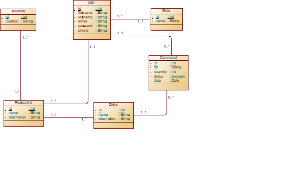

# MyMEAL
Application that permit to view available restaurants dishes and command for one.

### Project Structure:
There are two principal sections (parts):
- Frontend (User view) in **frontend** folder
- Backend (back service implementation) inside **backend** folder

### Project requirements:
- python >= 3.11 <= 3.12
After cloning the project, inside the **backend** folder run  `pip install -r requirements.txt` to install de necessary packages to run the code.
- PostgreSQL

[//]: # (create a database and run the script found in `mymeal.sql`)

### Project description
#### 1. Backend
It's a RestAPI develop with python framework **FastAPI**.
Inorder to run the backend, first ensure to be inside the **backend** folder
  `cd backend`
  Then run
  ` uvicorn application:application --reload`
  
